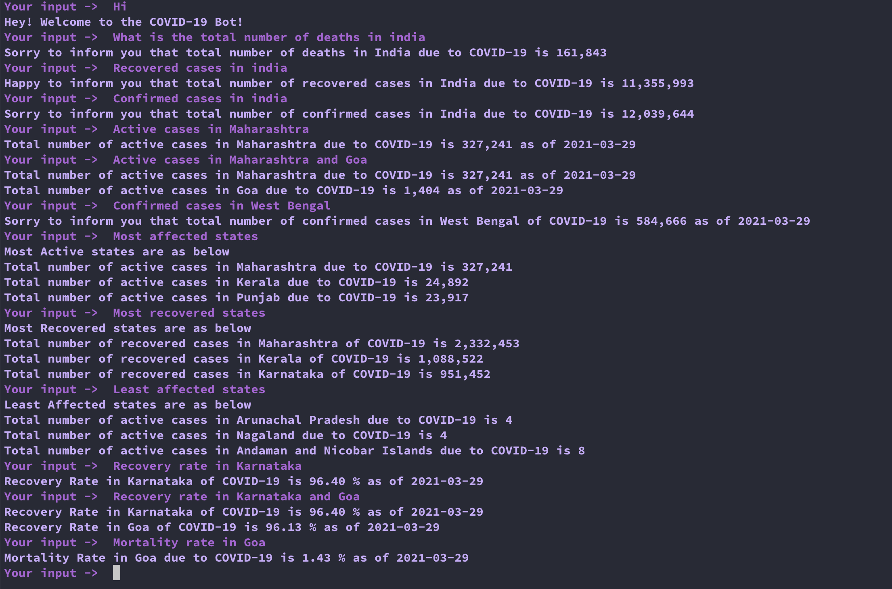
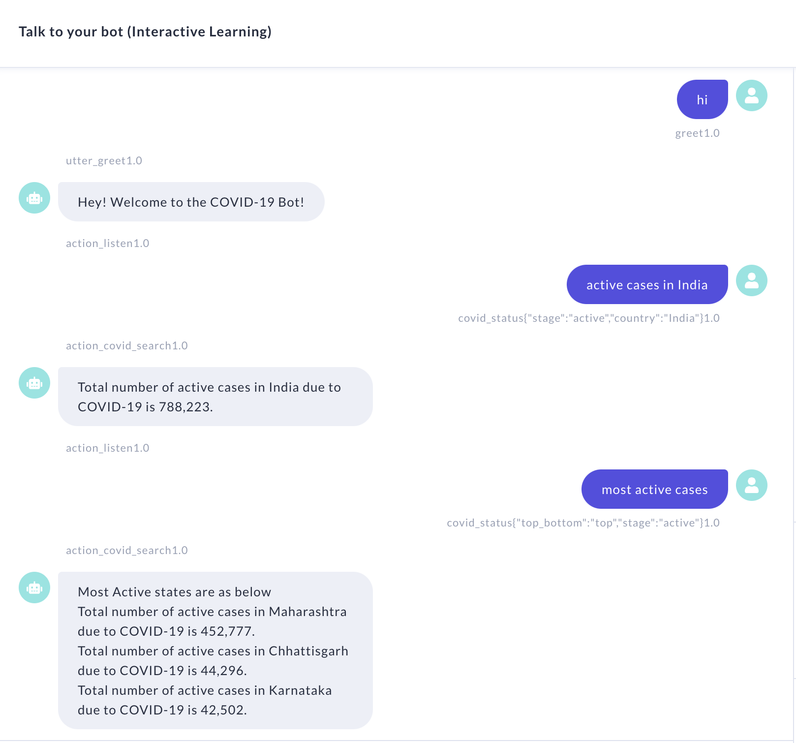
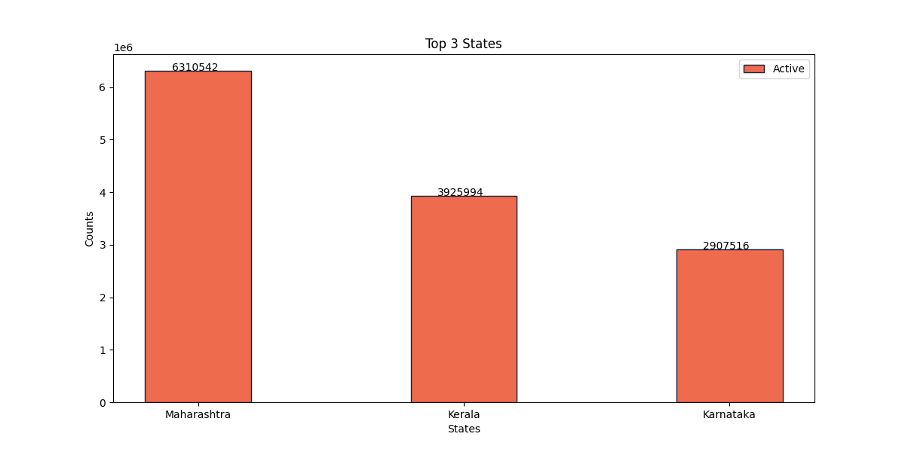
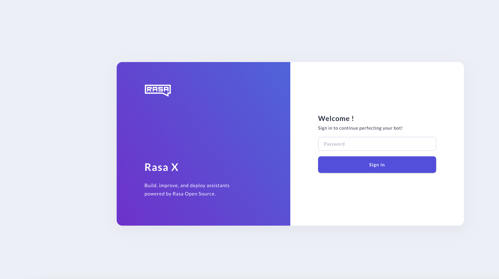
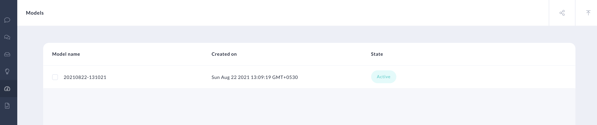

# Covi-India-Bot

This is an open source bot useful for querying information related to **Novel Coronavirus (COVID-19)**.

<!-- TABLE OF CONTENTS -->
<details open="open">
  <summary>Table of Contents</summary>
  <ol>
    <li>
      <a href="#about-the-project">About The Project</a>
      <ul>
        <li><a href="#built-with">Built With</a></li>
      </ul>
    </li>
    <li>
      <a href="#getting-started">Getting Started</a>
      <ul>
        <li><a href="#prerequisites">Prerequisites</a></li>
        <li><a href="#installation">Installation</a></li>
      </ul>
    </li>
    <li><a href="#usage">Usage</a></li>
    <li><a href="#acknowledgements">Acknowledgements</a></li>
     <li><a href="#license">License</a></li>
  </ol>
</details>

<!-- ABOUT THE PROJECT -->

## About The Project

This is an open source bot useful for querying information related to **Novel Coronavirus (COVID-19)** for India.




You can refer to the attached clip on how to use the COVID-INDIA Bot.

Video demonstration (click the picture):

[](https://youtu.be/YNOcLUNeJj0)

The data mainly comes from

1. [M-Media-Group/Covid-19-API](https://github.com/M-Media-Group/Covid-19-API) repository.
2. [Co-WIN Public APIs](https://apisetu.gov.in/public/marketplace/api/cowin/cowin-public-v2)

## Features

Currently, the Bot considers **India** and the states within.</br>
It has the below features.</br>

- It answers questions related COVID-19.
  - What is the total number of deaths in india?
  - How many recovered cases are there in india
  - How many confirmed cases are there in Ind
  - What is the total number of Active cases in Maharashtra
  - What is the total number of actve cases in Maharashtra and Goa
  - How many Confirmed cases are there in West Bengal
  - Which states are Most affected
  - Which states have maximum recovered states
  - Which states have most deaths
  - Which states are Least affected ?
  - What is the Recovery rate in Karnataka
  - What is the Recovery rate in Karnataka and Goa
  - What is the Mortality rate in Goa
- It can handle spelling mistakes.

- It can answers questions related to vaccination.

  - Number of people patially vaccinated in India
  - Number of people fully vaccinated

- It can answers questions related to vaccination slots availability.

  - Slots available in Pune
  - Slots available in Mumbai
  - Slots available in 400066

- It can handle out of context questions.

  - How are you?
  - How is the weather?

- It has RASA-X UI for Interactive training and usage

- It supports Facebok Messanger

- It Caches the API response for 30 min for faster response time

- It can return Charts along with the message

### Built With

- [Rasa : 2.8.0 ](https://rasa.com/docs/rasa/)
- [Python : 3.8 ](https://www.python.org/)
- [Rasa-SDK Action Server : 2.8.0 ](https://rasa.com/docs/action-server)
- [RASA-X :0.38.1](https://rasa.com/docs/rasa-x/)
- [Requests-cache](https://requests-cache.readthedocs.io/en/latest/user_guide.html)

<!-- GETTING STARTED -->

## Getting Started

### Prerequisites

- Python
- [Pipenv](https://pypi.org/project/pipenv/)
- [Docker](https://docs.docker.com/engine/install/)
- [Helm](https://helm.sh/docs/intro/install/)
- [Kubernetes](https://kubernetes.io/docs/setup/)

### Installation

- Clone the repository

  ```
  git clone https://github.com/sumanentc/COVID-19-bot.git
  ```

- Using RASA Shell and Stand alone Action Server

  1. Install dependencies

  ```
  pipenv shell

  pipenv install
  ```

  2. Train the model

  ```
  rasa train

  ```

  3. Start the Action Server

  ```
  rasa run actions -vv

  ```

  4. Start the RASA shell

  ```
  rasa shell -v
  ```

  5. Start asking questions on the RASA shell

- Using Docker Compose for Installation

**Note** : Here I am using my personal docker hub account to store the image: sumand

1. Build Action Server Docker image

```
docker build actions/ -t sumand/rasa-action-server:2.8.0

docker push sumand/rasa-action-server:2.8.0

```

2. Build Rasa NLU Docker image

```
docker build . -t sumand/rasa-server:2.8.0

docker push sumand/rasa-server:2.8.0
```

3. Start the NLU Container

```
docker-compose up
```

4. Test the Bot using REST API

```
curl -XPOST localhost:5005/webhooks/rest/webhook -d '{"sender":"Me","message":"what is the total number of deaths in india"}'
```

- Install the Bot along with RASA-X UI

1.  Build Action Server Docker image

```
docker build actions/ -t sumand/rasa-action-server:2.8.0

docker push sumand/rasa-action-server:2.8.0

```

2. Build Rasa NLU Docker image

```
docker build . -t sumand/rasa-server:2.8.0

docker push sumand/rasa-server:2.8.0
```

3. Install RASA-X. I used [Helm-Chart](https://rasa.com/docs/rasa-x/installation-and-setup/install/helm-chart) for installation.

3.1 Create new namespace for rasa deployment

```
kubectl create namespace rasa
```

3.2 deploy RASA-X using the Helm Chart along with the customization specified in values.yml

```
helm repo add rasa-x https://rasahq.github.io/rasa-x-helm

helm --namespace rasa install --values values.yml my-release rasa-x/rasa-x
```

3.3 Update the Helm Chart in case we need any changes

```
helm --namespace rasa upgrade --values values.yml my-release rasa-x/rasa-x
```

3.4 Delete all the deployment in case not required

```
helm uninstall my-release -n rasa

```

4. Deploy [RASA-X](https://rasa.com/docs/rasa-x/installation-and-setup/deploy)

After executing the above Helm Chart, check RAXA-X is deployed successfully. Execute the below commands to check if all the pods are up and running. Else check the logs of individual pods for ERROR.

```
kubectl get pods -n rasa
```

Once all the pods are up and running then the RASA-X UI can be opened using the below url. Use the Password specified in Values.yml file to login.

```
http://localhost:8000/login
```



Upload the model after login and make the model active



## Usage

Please respect the OPEN API Policy Usage

- [Policy on Open APIs](https://apisetu.gov.in/document-central/api-policy/)

<!-- ACKNOWLEDGEMENTS -->

## Acknowledgements

- [M-Media-Group/Covid-19-API](https://github.com/M-Media-Group/Covid-19-API)
- [Install RASA-X using Helm Chart](https://rasa.com/docs/rasa-x/installation-and-setup/install/helm-chart/)
- [Co-WIN Public APIs](https://apisetu.gov.in/public/marketplace/api/cowin/cowin-public-v2)

## License

Distributed under the MIT License. See `LICENSE` for more information.
